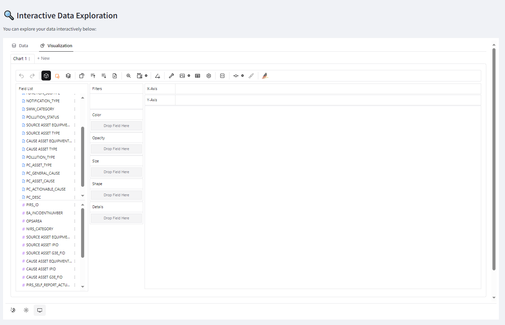

# 📊 Data Cleaning & Exploratory Data Analysis (EDA) App


Welcome to the **Data Cleaning & Exploratory Data Analysis (EDA) App**! This Streamlit-based application provides an intuitive interface for data scientists, analysts, and enthusiasts to upload, clean, analyze, and visualize datasets with ease.

## 📝 Table of Contents

- [📊 Data Cleaning & Exploratory Data Analysis (EDA) App](#-data-cleaning--exploratory-data-analysis-eda-app)
  - [🖥️ Features](#️-features)
    - [📥 Upload Data](#-upload-data)
    - [🧹 Data Cleaning](#-data-cleaning)
    - [📊 Exploratory Data Analysis (EDA)](#-exploratory-data-analysis-eda)
    - [📥 Export Data](#-export-data)
    - [⏮️ Timeline History](#️-timeline-history)
  - [🚀 Installation](#-installation)
  - [🛠️ Usage](#️-usage)
  - [📸 Screenshots](#-screenshots)
  - [🤝 Contributing](#-contributing)
  - [📜 License](#-license)
  - [📫 Contact](#-contact)

---

## 🖥️ Features

Our application is designed to streamline the data analysis workflow. Below are the key features:

### 📥 Upload Data

Easily upload your datasets in various formats including CSV, Excel, JSON, and Parquet.


### 🧹 Data Cleaning

Perform essential data cleaning operations such as handling missing values, removing duplicates, detecting and managing outliers, and encoding categorical variables.

- **Handle Missing Values:** Drop or fill missing data using different strategies.
- **Remove Duplicates:** Identify and eliminate duplicate records.
- **Outlier Detection & Handling:** Use Z-Score or IQR methods to detect and remove or cap outliers.
- **Data Transformation:** Standardize, normalize, and encode categorical variables.


### 📊 Exploratory Data Analysis (EDA)

Gain insights into your data with comprehensive EDA tools, including data previews, descriptive statistics, correlation heatmaps, and interactive visualizations using PyGWalker.

- **Data Preview:** View the first few rows and understand data types.
- **Descriptive Statistics:** Get summary statistics for numerical and categorical columns.
- **Correlation Matrix Heatmap:** Visualize correlations between numerical variables.
- **Interactive Data Exploration:** Use PyGWalker for dynamic and interactive data exploration.



### 📥 Export Data

Export the current state of your DataFrame at any point in the analysis. Choose between CSV and Excel formats for your downloads.


### ⏮️ Timeline History

Track all the transformations and changes made to your dataset with a comprehensive timeline. Revert to any previous state effortlessly to ensure data integrity.


---

## 🚀 Installation

Follow these steps to set up the application locally:

1. **Clone the Repository**

   ```bash
   git clone https://github.com/yourusername/data-cleaning-eda-app.git
   cd data-cleaning-eda-app
